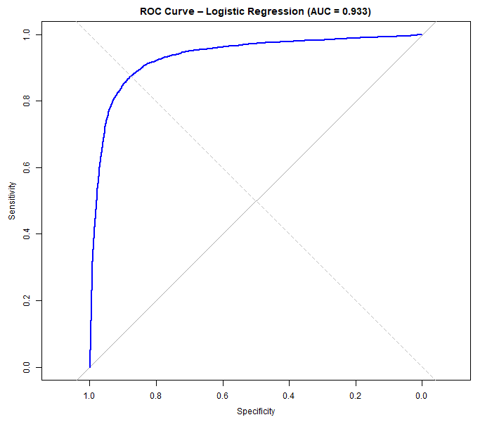

# AI Fake Review Detector (R)

NLP-based fake review detection using machine learning in R, leveraging
TF-IDF text features and supervised classification models.

## Problem Context

Online reviews significantly influence consumer decisions, but fake or
AI-generated reviews can distort ratings, reduce trust, and impact revenue.
This project builds a machine learning model to automatically distinguish
between real and deceptive reviews based on text patterns.

---

## Results

Two machine learning models were trained to detect deceptive reviews using
TF-IDF text features.

| Model | AUC |
|------|-----|
| Logistic Regression (Ridge) | **0.9334** |
| Random Forest (Top 1,000 terms) | 0.9249 |

Logistic regression achieved the highest AUC while remaining computationally
efficient and interpretable. Although the Random Forest model performed well,
it required dimensionality reduction and higher computational cost.

Based on these results, logistic regression was selected as the preferred model
for large-scale fake review detection.

---

## Model Performance Visualization

The ROC curve below illustrates the performance of the logistic regression
model across classification thresholds.

---

## Limitations

This model relies solely on textual features and does not incorporate reviewer
behavior or metadata. In practice, combining NLP with behavioral signals could
further improve detection accuracy.
