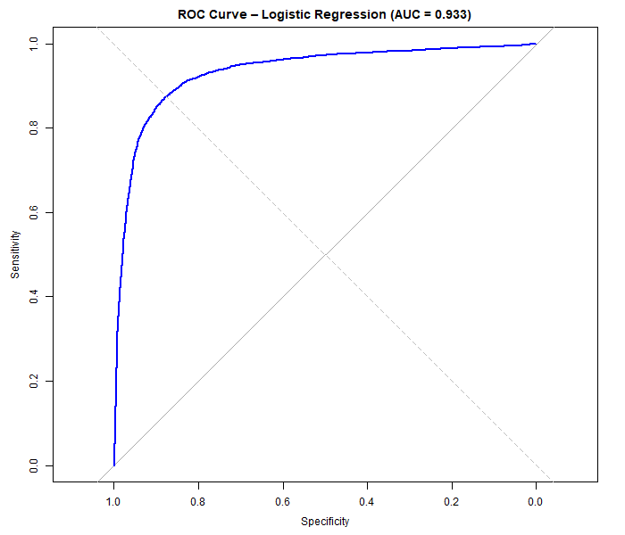

# AI Review Fraud Detection Using NLP

NLP-based fake review detection using machine learning in R, leveraging
TF-IDF text features and supervised classification models.

## Problem Context

Online reviews significantly influence consumer decisions, but fake or
AI-generated reviews can distort ratings, reduce trust, and impact revenue.
This project builds a machine learning model to automatically distinguish
between real and deceptive reviews based on text patterns.

---

## Dataset
The project used a labeled review dataset containing genuine and deceptive online reviews.

Key preprocessing steps included:

- text cleaning
- lowercasing
- stopword removal
- punctuation removal
- TF-IDF vectorization
- sparse matrix generation

The final feature space consisted of high-dimensional TF-IDF text features used for supervised classification. The dataset was divided into training and testing subsets to evaluate model generalization performance on unseen reviews.

---

## Methodology
The project followed a natural language processing and machine learning workflow:

- Clean and preprocess review text
- Convert text into TF-IDF feature vectors
- Split data into training and testing sets
- Train supervised classification models
- Evaluate models using ROC-AUC performance metrics

### Models Evaluated
- Logistic Regression with Ridge regularization
- Random Forest classifier

### Tools Used
- R
- tidyverse
- text2vec
- glmnet
- randomForest
- Matrix
- caret

### Feature Engineering
TF-IDF (Term Frequency–Inverse Document Frequency) was used to convert review text into numerical representations. This approach emphasizes important words that appear frequently within a review while reducing the weight of commonly occurring terms.

## Results

Two machine learning models were trained to detect deceptive reviews using
TF-IDF text features. Because TF-IDF generates high-dimensional sparse matrices, Ridge regularization helped reduce overfitting while maintaining strong predictive performance.

| Model               | AUC    | Accuracy | Precision |
| ------------------- | ------ | -------- | --------- |
| Logistic Regression | 0.9334 | 89%      | 91%       |
| Random Forest       | 0.9249 | 87%      | 88%       |

Logistic regression achieved the strongest balance between predictive performance, computational efficiency, and interpretability. The model also scaled more effectively to high-dimensional sparse TF-IDF features compared to Random Forest.

Based on these results, logistic regression was selected as the preferred model for large-scale fake review detection.

---

## Model Performance Visualization

The ROC curve below illustrates the performance of the logistic regression
model across classification thresholds.

## Limitations

This model relies solely on textual features and does not incorporate reviewer
behavior or metadata. In practice, combining NLP with behavioral signals could
further improve detection accuracy.

---

## Key Findings
- Logistic Regression achieved the highest ROC-AUC score (0.9334)
- TF-IDF features effectively captured deceptive language patterns
- Sparse linear models performed efficiently on high-dimensional text data
- Machine learning can support scalable automated moderation systems

---

## Business Impact
Fake reviews can reduce consumer trust, distort product ratings, and negatively influence purchasing decisions. Automated fake review detection systems can help platforms improve review quality, strengthen credibility, and reduce manipulation at scale.

---

## Future Improvements
Future versions of the model could incorporate:

- transformer-based NLP models (BERT)
- reviewer behavioral metadata
- sentiment analysis features
- deep learning approaches
- multilingual review detection
- real-time review monitoring pipelines
